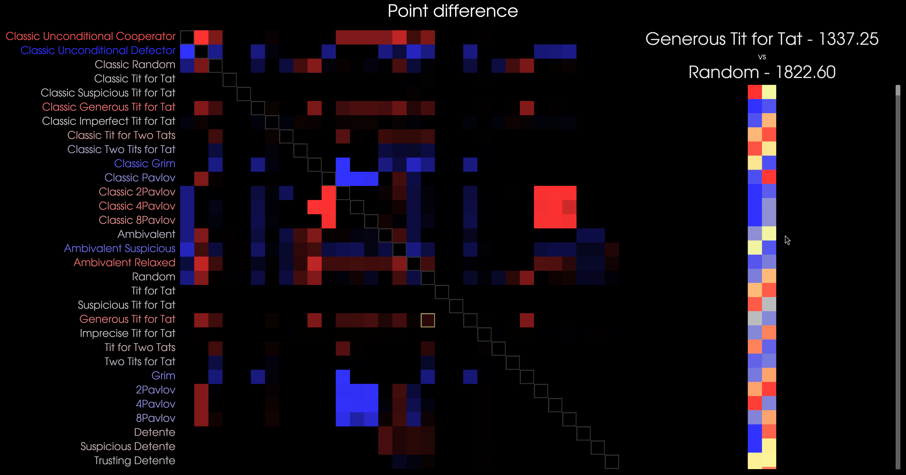

# Smooth Criminal
This is an implementation of [Nicky Case's Smooth Criminal](https://blog.ncase.me/backlog/#project_7). 
These are the point values for decisions each strategy can make. Each strategy plays every other strategy for 2000 rounds.

DISCLAIMER: Some implementations are probably wrong... like very wrong...

| A/B          |   A Cooperates   |    A Defects   |
|--------------|------------------|----------------|
| B Cooperates |    2.0/2.0       |    3.0/0.0     |
| B Defects    |    0.0/3.0       |    1.0/1.0     |

The twist here is that strategies can opt for values between cooperating and defecting. 
`0.0` represents cooperation while `1.0` represents defection.
Point values are determined through linear interpolation.
Below is the eval function representing the point calcuation.

```rust
fn eval(you: f64, other: f64) -> f64 {
    let you = you.clamp(COOPERATE, DEFECT);
    let other = other.clamp(COOPERATE, DEFECT);
    you - (2.0 * other) + 2.0
}
```

## Usage
Running this code with `cargo run --release` will generate a csv file with the results of each matchup, and images representing performance. 
It is recommended to build the optimized binary, as the increase in build time drastically increases performance.

Red indicates above average performance while blue indicates below average.
Columns are left unlabelled, but follow the same order as the rows from left to right.
White outlines indicate that the strategy is performing against itself, but can also be used as guidelines.

Clicking on a cell will bring up the inspector to view each round.


> Example of `points.png`

## Roadmap
The next iteration will feature an interactive UI to exclude/include strategies, and provide an easy way to import and export data.
